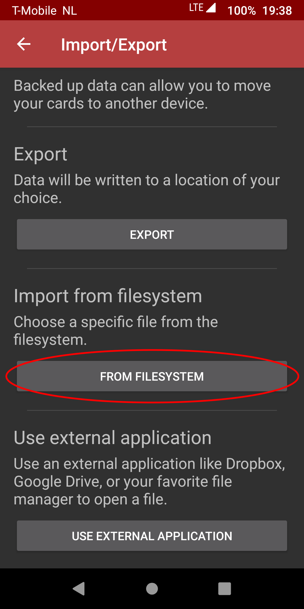
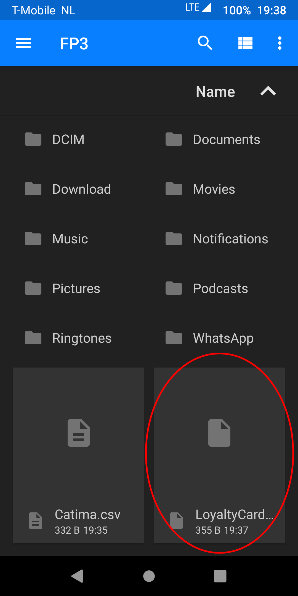

# Migrating from Loyalty Card Keychain

As Catima is based on Loyalty Card Keychain, importing your data from it is very simple.

## 1. Open Loyalty Card Keychain

## 2. Press the More Options button in the top right

## 3. Press Import/Export

## 4. Press Export

## 5. Choose a save location, filename (default: LoyaltyCardKeychain.csv) and press Save

## 6. Confirm the export was succesful

## 7. Open Catima

## 8. Press the More Options button in the top right

## 9. Press Import/Export

## 10. Press From Filesystem

## 11. Choose the file you saved in step 5

## That's it, you've succesfully imported your Loyalty Card Keychain database into Catima
